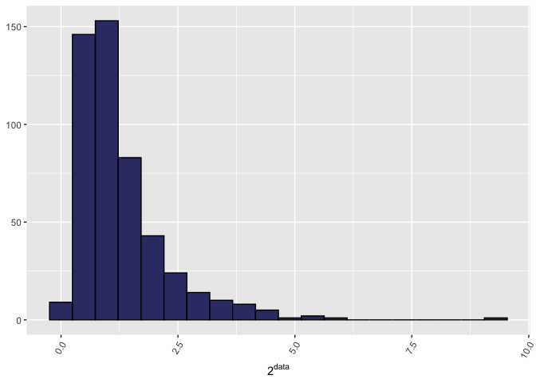

<!-- README.md is generated from README.Rmd. Please edit that file -->

<!-- Extra CSS -->

<!-- Utilitary functions -->

<!-- /Library/Frameworks/R.framework/Versions/4.0/Resources/library/MetaPipe/images/metapipe.png -->

# MetaPipe 

MetaPipe: A High-Performance Computing pipeline for QTL mapping of large
metabolomic datasets <!-- badges: start -->
<!-- [](https://travis-ci.com/villegar/MetaPipe) -->
[](https://travis-ci.com/villegar/MetaPipe)
[](https://github.com/villegar/MetaPipe)
[](https://github.com/villegar/MetaPipe)<!-- [](https://cran.r-project.org/package=MetaPipe) -->
[](https://codecov.io/gh/villegar/MetaPipe)
[](https://github.com/villegar/MetaPipe/actions)
<!-- [](https://cran.r-project.org/package=MetaPipe) -->
<!-- [](https://cran.r-project.org/web/checks/check_results_MetaPipe.html) -->
<!-- [](https://github.com/villegar/MetaPipe/actions) -->

<!-- badges: end -->

## Overview

The goal of MetaPipe is to provide an easy to use and powerful tool
capable of performing QTL mapping analyses.
<!-- on metabolomics data. -->

## Installation

<!-- You can install the released version of MetaPipe from [CRAN](https://CRAN.R-project.org) with: -->

<!-- ``` r -->

<!-- install.packages("MetaPipe") -->

<!-- ``` -->

<!-- And the development version from [GitHub](https://github.com/) with: -->

You can install the development version from
[GitHub](https://github.com/) with:

``` r
# install.packages(c("hexSticker", "kableExtra", "qpdf", remotes")
remotes::install_github("villegar/MetaPipe", build_vignettes = TRUE)
```

## Example

<!-- This is a basic example which shows you how to solve a common problem: -->

You should start by loading `MetaPipe` on your session.

``` r
library(MetaPipe)
```

### Load raw data

For details about the data structure and extended documentation, see the
vignette [Load Raw
Data](https://villegar.github.io/MetaPipe/articles/load-raw-data).

``` r
vignette("load-raw-data", package = "MetaPipe")
```

#### Function call

``` r
load_raw(raw_data_filename = "FILE.CSV", excluded_columns = c(...))
```

where `raw_data_filename` is the filename containg the raw data, both
absolute and relative paths are accepted. Next, the argument
`excluded_columns` is a vector containing the indices of the properties,
e.g. `c(2, 3, ..., M)`.

``` r
# Toy dataset
set.seed(123)
example_data <- data.frame(ID = c(1,2,3,4,5),
                           P1 = c("one", "two", "three", "four", "five"), 
                           T1 = rnorm(5), 
                           T2 = rnorm(5),
                           T3 = c(NA, rnorm(4)),                     #  20 % NAs
                           T4 = c(NA, 1.2, -0.5, NA, 0.87),          #  40 % NAs
                           T5 = NA)                                  # 100 % NAs
## Write to disk
write.csv(example_data, "example_data.csv", row.names = FALSE)

# Load the data
load_raw("example_data.csv", c(2))
#>   ID    P1          T1         T2        T3    T4 T5
#> 1  1   one -0.56047565  1.7150650        NA    NA NA
#> 2  2   two -0.23017749  0.4609162 1.2240818  1.20 NA
#> 3  3 three  1.55870831 -1.2650612 0.3598138 -0.50 NA
#> 4  4  four  0.07050839 -0.6868529 0.4007715    NA NA
#> 5  5  five  0.12928774 -0.4456620 0.1106827  0.87 NA
```

### Replace missing data

For extended documentation, see the vignette [Replace Missing
Data](https://villegar.github.io/MetaPipe/articles/replace-missing-data).

``` r
vignette("replace-missing-data", package = "MetaPipe")
```

#### Function call

``` r
replace_missing(raw_data = example_data, 
                excluded_columns = c(2), 
                # Optional
                out_prefix = "metapipe", prop_na = 0.5, replace_na = FALSE)
```

where `raw_data` is a data frame containing the raw data, as described
in [Load Raw Data](#load-raw-data) and `excluded_columns` is a vector
containing the indices of the properties, e.g. `c(2, 3, ..., M)`. The
other arguments are optional, `out_prefix` is the prefix for output
files, `prop_na` is the proportion of NA values (used to drop traits),
and `replace_na` is a logical flag to indicate whether or not NAs should
be replace by half of the minimum value.

``` r
# Inserting missing values manually
example_data$T1[2:3] <- NA
example_data$T2[4] <- NA

# No changes expected
replace_missing(example_data, c(2))
#> The following traits were dropped because they have 50% or more missing values: 
#> T5
#>   ID    P1          T1         T2        T3    T4
#> 1  1   one -0.56047565  1.7150650        NA    NA
#> 2  2   two          NA  0.4609162 1.2240818  1.20
#> 3  3 three          NA -1.2650612 0.3598138 -0.50
#> 4  4  four  0.07050839         NA 0.4007715    NA
#> 5  5  five  0.12928774 -0.4456620 0.1106827  0.87

# Traits with 25% of NA should be dropped
replace_missing(example_data, c(2), prop_na =  0.25)
#> The following traits were dropped because they have 25% or more missing values: 
#> T1, T4, T5
#>   ID    P1         T2        T3
#> 1  1   one  1.7150650        NA
#> 2  2   two  0.4609162 1.2240818
#> 3  3 three -1.2650612 0.3598138
#> 4  4  four         NA 0.4007715
#> 5  5  five -0.4456620 0.1106827

# NAs should be replaced by half of the minimum value
replace_missing(example_data, c(2), replace_na =  TRUE)
#> The following traits were dropped because they have 100% missing values: 
#> T5
#>   ID    P1          T1         T2         T3    T4
#> 1  1   one -0.56047565  1.7150650 0.05534136 -0.25
#> 2  2   two -0.28023782  0.4609162 1.22408180  1.20
#> 3  3 three -0.28023782 -1.2650612 0.35981383 -0.50
#> 4  4  four  0.07050839 -0.6325306 0.40077145 -0.25
#> 5  5  five  0.12928774 -0.4456620 0.11068272  0.87
```

### Assess normality

For extended documentation, see the vignette [Assess
Normality](https://villegar.github.io/MetaPipe/articles/assess-normality).

``` r
vignette("assess-normality", package = "MetaPipe")
```

`MetaPipe` assesses the normality of variables (traits) by performing a
Shapiro-Wilk test on the raw data (see [Load Raw
Data](load-raw-data.html) and [Replace Missing
Data](replace-missing-data.html)). Based on whether or not the data
approximates a normal distribution, an array of transformations will be
computed, and the normality assessed one more time.

#### Function call

``` r
assess_normality(raw_data = raw_data, 
                 excluded_columns = c(2, 3, ..., M), 
                 # Optional
                 cpus = 1, 
                 out_prefix = "metapipe", 
                 plots_dir = getwd(), 
                 transf_vals = c(2, exp(1), 3, 4, 5, 6, 7, 8, 9, 10))
```

where `raw_data` is a data frame containing the raw data, as described
in [Load Raw Data](load-raw-data.html) and `excluded_columns` is a
vector containing the indices of the properties, e.g. `c(2, 3, ..., M)`.
The other arguments are optional, `cpus` is the number of cores to use,
in other words, the number of concurrent traits to process, `out_prefix`
is the prefix for output files, `plots_dir` is the output directory
where the plots will be stored, and `transf_vals` is a vector containing
the transformation values to be used when transforming the original
data.

#### Example

The following histogram shows a sample data obtained from a normal
distribution with the command `rnorm`, but it was transformed using the
power (base `2`) function; thus, the data seems to be
skewed:



Using `MetaPipe` we can find an optimal transformation that “normalises”
this data set:

``` r
example_data <- data.frame(ID = 1:500,
                           T1 = test_data,
                           T2 = 2^test_data)
transformed_data <- MetaPipe::assess_normality(example_data, c(1))
```

The top 5 entries for the trait `T1`
are:

<table style="width:100%; margin-left: auto; margin-right: auto;" class="table table-striped table-hover">

<thead>

<tr>

<th style="text-align:center;color: #EEEEEE !important;background-color: #363B74 !important;vertical-align: middle;">

index

</th>

<th style="text-align:center;color: #EEEEEE !important;background-color: #363B74 !important;vertical-align: middle;">

feature

</th>

<th style="text-align:center;color: #EEEEEE !important;background-color: #363B74 !important;vertical-align: middle;">

values

</th>

<th style="text-align:center;color: #EEEEEE !important;background-color: #363B74 !important;vertical-align: middle;">

flag

</th>

<th style="text-align:center;color: #EEEEEE !important;background-color: #363B74 !important;vertical-align: middle;">

transf

</th>

<th style="text-align:center;color: #EEEEEE !important;background-color: #363B74 !important;vertical-align: middle;">

transf\_val

</th>

</tr>

</thead>

<tbody>

<tr>

<td style="text-align:center;border-left:1px solid;border-right:1px solid;">

1

</td>

<td style="text-align:center;border-left:1px solid;border-right:1px solid;">

T1

</td>

<td style="text-align:center;border-left:1px solid;border-right:1px solid;">

\-0.5604756

</td>

<td style="text-align:center;border-left:1px solid;border-right:1px solid;">

Normal

</td>

<td style="text-align:center;border-left:1px solid;border-right:1px solid;">

</td>

<td style="text-align:center;border-left:1px solid;border-right:1px solid;">

</td>

</tr>

<tr>

<td style="text-align:center;border-left:1px solid;border-right:1px solid;">

1

</td>

<td style="text-align:center;border-left:1px solid;border-right:1px solid;">

T1

</td>

<td style="text-align:center;border-left:1px solid;border-right:1px solid;">

\-0.2301775

</td>

<td style="text-align:center;border-left:1px solid;border-right:1px solid;">

Normal

</td>

<td style="text-align:center;border-left:1px solid;border-right:1px solid;">

</td>

<td style="text-align:center;border-left:1px solid;border-right:1px solid;">

</td>

</tr>

<tr>

<td style="text-align:center;border-left:1px solid;border-right:1px solid;">

1

</td>

<td style="text-align:center;border-left:1px solid;border-right:1px solid;">

T1

</td>

<td style="text-align:center;border-left:1px solid;border-right:1px solid;">

1.5587083

</td>

<td style="text-align:center;border-left:1px solid;border-right:1px solid;">

Normal

</td>

<td style="text-align:center;border-left:1px solid;border-right:1px solid;">

</td>

<td style="text-align:center;border-left:1px solid;border-right:1px solid;">

</td>

</tr>

<tr>

<td style="text-align:center;border-left:1px solid;border-right:1px solid;">

1

</td>

<td style="text-align:center;border-left:1px solid;border-right:1px solid;">

T1

</td>

<td style="text-align:center;border-left:1px solid;border-right:1px solid;">

0.0705084

</td>

<td style="text-align:center;border-left:1px solid;border-right:1px solid;">

Normal

</td>

<td style="text-align:center;border-left:1px solid;border-right:1px solid;">

</td>

<td style="text-align:center;border-left:1px solid;border-right:1px solid;">

</td>

</tr>

<tr>

<td style="text-align:center;border-left:1px solid;border-right:1px solid;">

1

</td>

<td style="text-align:center;border-left:1px solid;border-right:1px solid;">

T1

</td>

<td style="text-align:center;border-left:1px solid;border-right:1px solid;">

0.1292877

</td>

<td style="text-align:center;border-left:1px solid;border-right:1px solid;">

Normal

</td>

<td style="text-align:center;border-left:1px solid;border-right:1px solid;">

</td>

<td style="text-align:center;border-left:1px solid;border-right:1px solid;">

</td>

</tr>

<tr>

<td style="text-align:center;border-left:1px solid;border-right:1px solid;">

1

</td>

<td style="text-align:center;border-left:1px solid;border-right:1px solid;">

T1

</td>

<td style="text-align:center;border-left:1px solid;border-right:1px solid;">

1.7150650

</td>

<td style="text-align:center;border-left:1px solid;border-right:1px solid;">

Normal

</td>

<td style="text-align:center;border-left:1px solid;border-right:1px solid;">

</td>

<td style="text-align:center;border-left:1px solid;border-right:1px solid;">

</td>

</tr>

</tbody>

</table>

And for trait
`T2`:

<table style="width:100%; margin-left: auto; margin-right: auto;" class="table table-striped table-hover">

<thead>

<tr>

<th style="text-align:center;color: #EEEEEE !important;background-color: #363B74 !important;vertical-align: middle;">

index

</th>

<th style="text-align:center;color: #EEEEEE !important;background-color: #363B74 !important;vertical-align: middle;">

feature

</th>

<th style="text-align:center;color: #EEEEEE !important;background-color: #363B74 !important;vertical-align: middle;">

values

</th>

<th style="text-align:center;color: #EEEEEE !important;background-color: #363B74 !important;vertical-align: middle;">

flag

</th>

<th style="text-align:center;color: #EEEEEE !important;background-color: #363B74 !important;vertical-align: middle;">

transf

</th>

<th style="text-align:center;color: #EEEEEE !important;background-color: #363B74 !important;vertical-align: middle;">

transf\_val

</th>

</tr>

</thead>

<tbody>

<tr>

<td style="text-align:center;border-left:1px solid;border-right:1px solid;">

2

</td>

<td style="text-align:center;border-left:1px solid;border-right:1px solid;">

T2

</td>

<td style="text-align:center;border-left:1px solid;border-right:1px solid;">

\-0.5604756

</td>

<td style="text-align:center;border-left:1px solid;border-right:1px solid;">

Normal

</td>

<td style="text-align:center;border-left:1px solid;border-right:1px solid;">

log

</td>

<td style="text-align:center;border-left:1px solid;border-right:1px solid;">

2

</td>

</tr>

<tr>

<td style="text-align:center;border-left:1px solid;border-right:1px solid;">

2

</td>

<td style="text-align:center;border-left:1px solid;border-right:1px solid;">

T2

</td>

<td style="text-align:center;border-left:1px solid;border-right:1px solid;">

\-0.2301775

</td>

<td style="text-align:center;border-left:1px solid;border-right:1px solid;">

Normal

</td>

<td style="text-align:center;border-left:1px solid;border-right:1px solid;">

log

</td>

<td style="text-align:center;border-left:1px solid;border-right:1px solid;">

2

</td>

</tr>

<tr>

<td style="text-align:center;border-left:1px solid;border-right:1px solid;">

2

</td>

<td style="text-align:center;border-left:1px solid;border-right:1px solid;">

T2

</td>

<td style="text-align:center;border-left:1px solid;border-right:1px solid;">

1.5587083

</td>

<td style="text-align:center;border-left:1px solid;border-right:1px solid;">

Normal

</td>

<td style="text-align:center;border-left:1px solid;border-right:1px solid;">

log

</td>

<td style="text-align:center;border-left:1px solid;border-right:1px solid;">

2

</td>

</tr>

<tr>

<td style="text-align:center;border-left:1px solid;border-right:1px solid;">

2

</td>

<td style="text-align:center;border-left:1px solid;border-right:1px solid;">

T2

</td>

<td style="text-align:center;border-left:1px solid;border-right:1px solid;">

0.0705084

</td>

<td style="text-align:center;border-left:1px solid;border-right:1px solid;">

Normal

</td>

<td style="text-align:center;border-left:1px solid;border-right:1px solid;">

log

</td>

<td style="text-align:center;border-left:1px solid;border-right:1px solid;">

2

</td>

</tr>

<tr>

<td style="text-align:center;border-left:1px solid;border-right:1px solid;">

2

</td>

<td style="text-align:center;border-left:1px solid;border-right:1px solid;">

T2

</td>

<td style="text-align:center;border-left:1px solid;border-right:1px solid;">

0.1292877

</td>

<td style="text-align:center;border-left:1px solid;border-right:1px solid;">

Normal

</td>

<td style="text-align:center;border-left:1px solid;border-right:1px solid;">

log

</td>

<td style="text-align:center;border-left:1px solid;border-right:1px solid;">

2

</td>

</tr>

<tr>

<td style="text-align:center;border-left:1px solid;border-right:1px solid;">

2

</td>

<td style="text-align:center;border-left:1px solid;border-right:1px solid;">

T2

</td>

<td style="text-align:center;border-left:1px solid;border-right:1px solid;">

1.7150650

</td>

<td style="text-align:center;border-left:1px solid;border-right:1px solid;">

Normal

</td>

<td style="text-align:center;border-left:1px solid;border-right:1px solid;">

log

</td>

<td style="text-align:center;border-left:1px solid;border-right:1px solid;">

2

</td>

</tr>

</tbody>

</table>

As expected both tables show the same entries; however, the latter
indicates that `T2` was transformed using \(`\log_2`\). The function
will generate histograms for all the traits, the naming convention used
is:

  - `HIST_[index]_[transf]_[transf_val]_[feature].png` for transformed
    traits
  - `HIST_[index]_NORM_[feature].png` for those that were not
    transformed.

For the previous data set `HIST_1_NORM_T1.png` and
`HIST_2_LOG_2_T2.png`:


<!-- The figures below show the original data (`T1`) and the transfomed data (`T2`): -->
